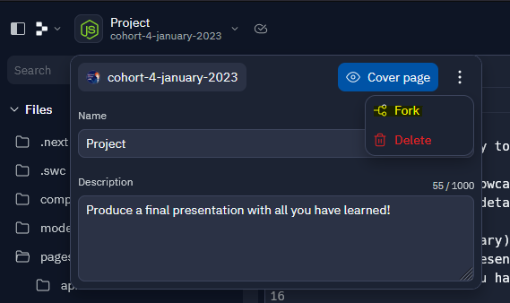

# Final Project

Welcome to the final task of the Code Academy 2023! :clap:

We've covered a lot of ground in the past few weeks:
- HTML & CSS
- Typescript
- React & Next.js
- SQL

Now this is your opportunity to put everything together and show off what you can do!

We would like you to showcase a full-stack webstore application built with Next.js and Supabase. The full details are listed below, under 'Acceptance Criteria'.

Next Friday (10th February) will be the final day of our journey together, where you will perform a short presentation based on your experience on the course, and demonstrate the work you have done in this final project. Some of our technical leaders from Sidetrade will be there to see just how far you have come!

This REPL contains the same starter template as the 'At Home' tasks from Web Fundamentals. If you like, you can use this template to get yourself started, or, if you have already spent some time working on your app from previous weeks, you can 'fork' your old REPL to create a new one, and then continue working from there.

To do this, first open your old REPL, then click your project name in the top left, then the three dots to open the menu. Click 'Fork' and name your new REPL 'Final Project', then finally, invite myself and Luke to this new REPL so we can see your work.

### Acceptance Criteria

If you've completed all of the tasks up until now, then you already have a solid foundation for this project. We would like you to present a full-stack webstore application, that displays products from a database, allows navigation into product details, and has a consistent layout and style.

**Essentials:**
1. A home page with a header, a list of products, and a footer with some company info.
2. Navigation to a product detail page, which displays more information about one product. On this page, we should also be able to navigate back to the products list.
4. A consistent shared layout and styling. Try and change the way the products are displayed or play around with different designs, colours, and layouts. Show off what you can do!

If you made some progress on the 'At Home' tasks from Web Fundamentals, you should have started working on some more advanced features. Include some of these to make your work stand out!

**Possible goals:**
1. Your list of products displays across multiple pages, and the number of products displayed per page is able to be selected by the user.
    1. Your database only has 15 products defined, but you can add as many as you like.
3. Products are separated into categories and the the user can select a category to only see those products displayed.
     1. You will need to add a new 'category' column to your database table to get this working. Ask Jack or Ryan about this!
4. Your products have real images displayed. Again, you could accomplish this by adding a new column in your table for an image URL.
5. There are other optional filters that let the user search or narrow down the product list, e.g. a price range.
6. Users can add products to a 'Cart' or 'Basket' and see what they have added.
    1. Bonus points if you can save this when the page is refreshed!
7. The sky is the limit! Check out your favourite sites for inspiration.

If this looks a little intimidating, that's okay! Play to your strengths, and focus on the tasks that are most enjoyable to you. There are three possible pathways:
1. If you enjoy the visual aspect of making your site look great, then you should focus your time on this and make sure it's as fabulous as it can be.
2. If you prefer working on the technical parts and connecting things together, then make sure you pack in all those features and don't worry too much about the aesthetics.
3. If you enjoyed working on your database and the data analysis tasks, you could create a page on your site that visualises some interesting metrics, such as 'How many other customers bought this product?' or 'Which items are most popular?'

### Trello

https://trello.com/

At the start of this course we mentioned a development methodology called Kanban; the concept of Kanban is that your organise your project into small tasks that then move through your Kanban board as they progress. 

This is optional, but using Trello can help you to plan out what you need to do and how to do it, to maximise the use of your time on this project.

Go to the Trello web app above and create an account, then create a board with 3 columns: To Do, In Progress, and Done. Think of what tasks you need to complete and add them into the To Do column. Then, as you pick up a task, move it into In Progress, and when you complete it, move it to Done.

### Presentation

On the day, you will give a short presentation and then a demo of what you have built. Please put together one or two slides and make sure you include:
- Who you are and your background
- Which parts of the course you found the most interesting/enjoyable and why
- The goals of your project and a quick retrospective (what went well, what didn't go well)
- A demo!

Be prepared for one or two questions!

**Good luck!** :muscle: